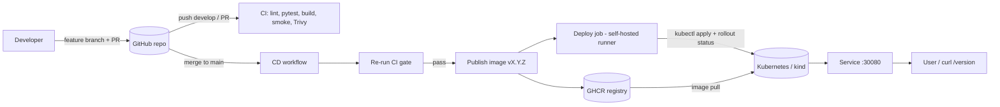

# Architecture

```mermaid
flowchart LR
  Dev[Developer] -->|feature branch + PR| GH[(GitHub repo)]
  GH -->|push develop / PR| CI[CI: lint, pytest, build, smoke, Trivy]
  GH -->|merge to main| CD[CD workflow]
  CD --> CI2[Re-run CI gate]
  CI2 -->|pass| PUB[Publish image vX.Y.Z]
  PUB --> GHCR[(GHCR registry)]
  PUB --> DEP[Deploy job - self-hosted runner]
  DEP -->|kubectl apply + rollout status| K8S[(Kubernetes / kind)]
  GHCR -->|image pull| K8S
  K8S --> SVC[Service :30080] --> USER[User / curl /version]
```
Export this as `docs/architecture.png` via https://mermaid.live (or screenshot GitHub's render).
